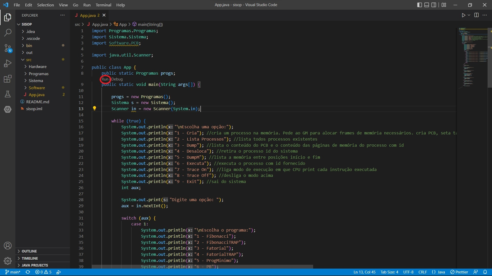

## Trabalho de Sistemas Operacionais

Integrantes:
- Diego Klein
- Vitor Delela
- Lucas Martins

O projeto esta dividido em 2 pastas diferentes:

- Trabalho 1A
- Trabalho 1B

Para a execução do trabalho, recomendamos o uso da IDE Visual Studio Code.

Instruções de como executar o projeto:

- 1 - Dentro do arquivo App.java dentro da pasta src, selecione "Run" acima do nome da classe.

