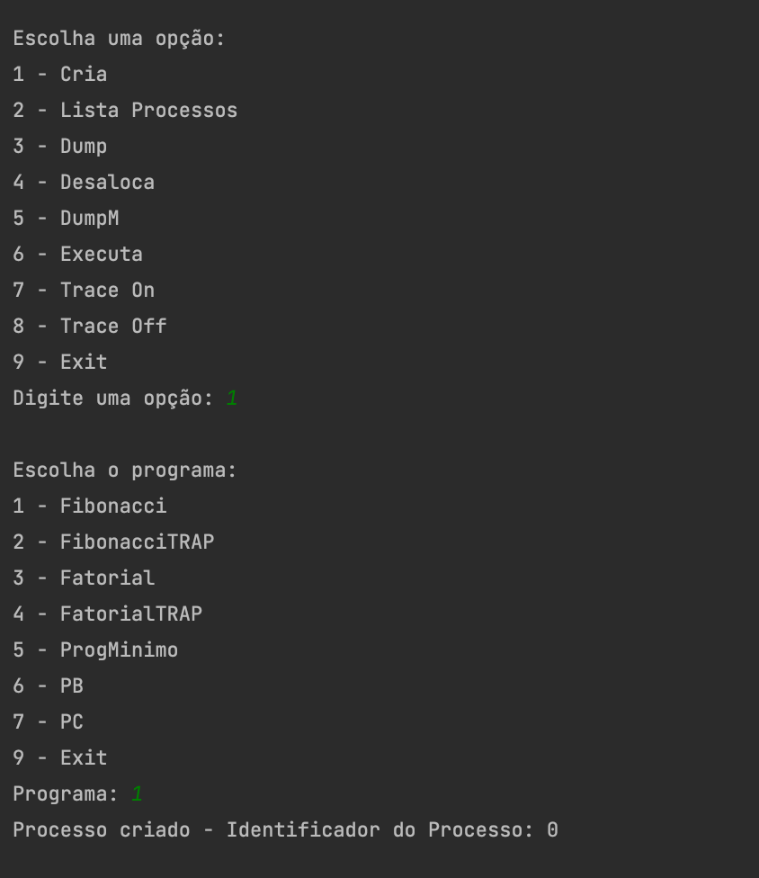
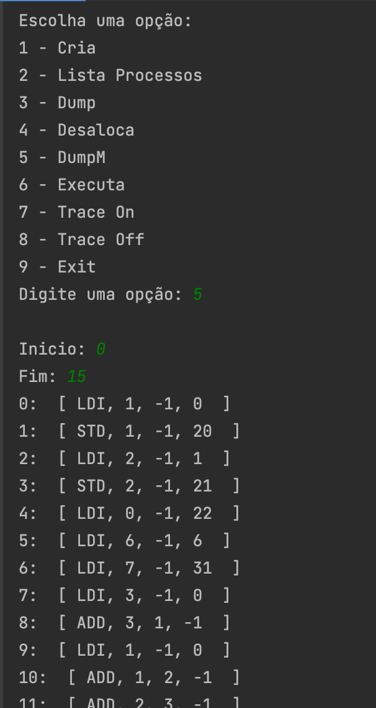

## Trabalho de Sistemas Operacionais

Integrantes:
- Diego Klein
- Vitor Delela
- Lucas Martins

O projeto esta dividido em 2 pastas diferentes:

- Trabalho 1A
- Trabalho 1B

Para a execução do trabalho, recomendamos o uso da IDE Visual Studio Code.

### Implementação

#### 1A
- [x] PCB
- [x] GM
- [x] GP

#### 1B
- [x] PCB
- [x] GM
- [x] GP

#### Testes

#### 1A

Criar Processo:

Desaloca Processo:

Dump de Memoria:

Dump de Processo:

Executa Processos:

Lista Processos:

Trace Off:

Trace On:

#### 1B
